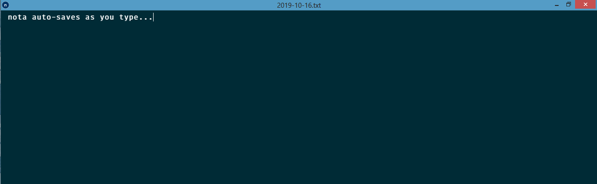
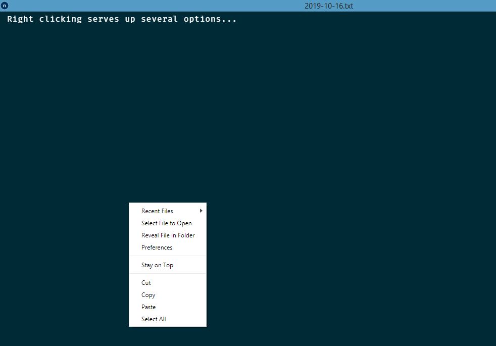
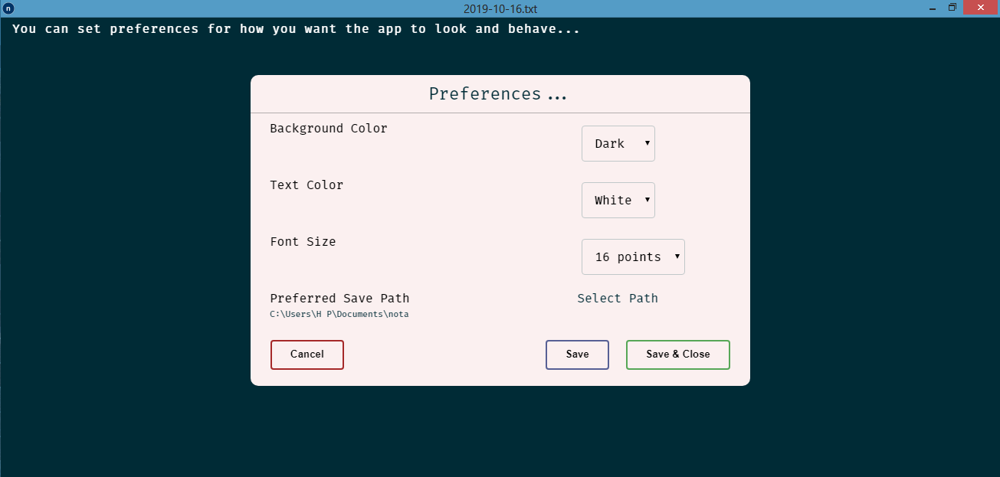
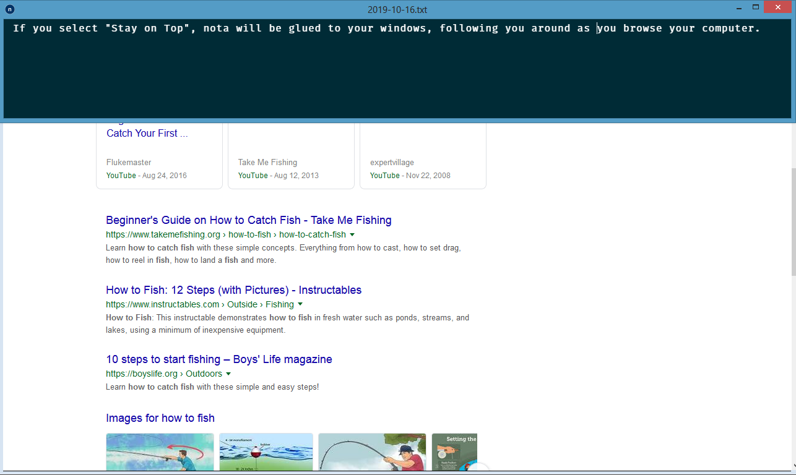

<h1 align="center">nota</h1>

Inspired by the [fromScratch](https://electronjs.org/apps/fromscratch) app, nota is a refreshingly better way to document your thoughts, save your notes and keep track of your journals.

With no frills, bells or whistles, you are given a daily fresh canvas to paint with your words. No thousand commands to learn, no need to save, just keep writing.

Features:
* Autosave. No need to press ctrl+S. As you type, we save.

* Pinnable. Would you like to pin nota to the top of your windows? So that it follows you as your research the web, open other apps? We got you!

* Customizable. Would you love to change the colors of the texts or the colors of the background? Say no more **We have only two options available right now. More to be added later**

* Upload Any Text File. We provide you with fresh nota canvas everyday, named with the date, but we also allow you to upload and choose your own file to edit.

* Configurable. You dont like where we store your files? Change it!

* Open Source. You want to extend nota, or even fork it? You can go ahead. The software is free. As in free lunch. 

  

  

  

  

_**nota is available on Windows for now, because that is the OS that I have. You can download the source code and compile it to any of other popular platforms like Linux and macOS._** 

## License

